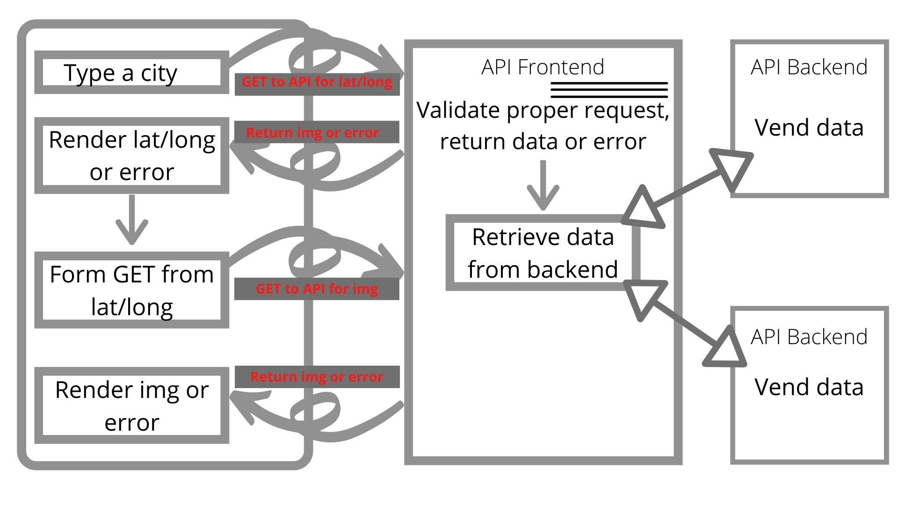

>**Lab:** #, **Feature:** #: #,
>>**Estimate amount of time needed to complete:** #,
>>>**Start time:** #,
>>>>**Finish time:** #,
>>>>>**Actual time needed to complete:** #,
>>>>>>**Key requirements:** #.

>**LAB - Number -** 6/7/8/9
>>Project Name: **City Explorer** 
>>>Description: This App will ask a user for a city name and display information regarding that city such as an image of a map,

>**Author: Brutalism**,
>>**Links and Resources:**
>>>**submission PR:** 
>>>>**URL:** https://city-explorer-brutal.netlify.app
>>>>>**GitHub Repo:** https://github.com/CodeFellows-SchoolWork/city-explorer  
>>>>>>**Server Url:**https://city-explorer-brutal.herokuapp.com/
>>>>>>>**Links you used as reference:**
>>>>>>>>**Reflections and Comments:**
If you would like to get this app to work on your local server make sure to create a new .env file and follow the steps in the sampleEnv file.

>**Lab:** 6, **Feature:** Setup: Create and setup a react app,
>>**Estimate amount of time needed to complete:** 3hr,
>>>**Start time:** 10:00am Wed-Jul-28,
>>>>**Finish time:** #,
>>>>>**Actual time needed to complete:** #,
>>>>>>**Key requirements:** GitHub repo, react app created, env setup, install axios and bootstrap, deploy to netlify.
>>>>>>>**Do This YourSelf**  
Create a react app in your terminal- NPM create-react-app (name of App),   
Create GitHub repo and follow the directions on how to link a repo from the command line,  
Add env to your gitignore,  
NPM I axios, bootstrap
Link your new repo to Netlify.

>**Lab:** 7/8, **Feature:** 1: Add location map and data,
>>**Estimate amount of time needed to complete:** 10 hours,
>>>**Start time:** Unknown,
>>>>**Finish time:** Unknown,
>>>>>**Actual time needed to complete:** around 10 hours,
>>>>>>**Key requirements:** Display map and city data as well as send a request to the back-end server for weather and movie data related to the city.

